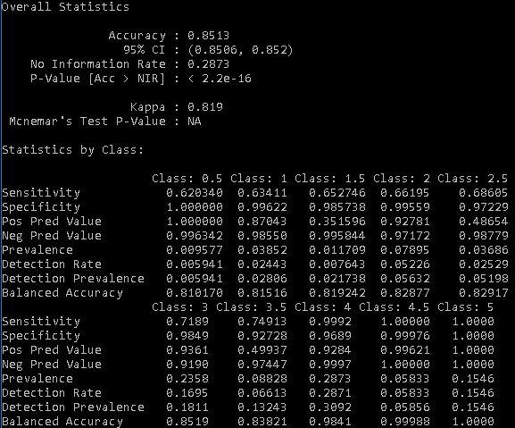

```{r, include=FALSE}
knitr::opts_chunk$set(echo = TRUE)
```

# 1. Executive Summary

### Background and Motivation
A recommender system or a recommendation system is a subclass of information filtering system that seeks to predict the "rating" or "preference" a user would give to an item. In this project the items are movies.

Recommender systems are utilized in a variety of areas including movies, music, news, books, research articles, search queries, social tags, and products in general. There are also recommender systems for experts collaborators, jokes, restaurants, garments, financial services, life insurance, romantic partners (online dating), and Twitter page. Major companies such as Amazon, Netflix and Spotify utilize recommendation systems. A strong recommendation system was of such importance that in 2006, Netflix offered a million dollar prize to anyone who could improve the effectiveness of its recommendation system by 10%.

It should be noted that the winning Netflix model utilized an ensemble of very complex models, and the team spent several months perfecting the ensemble. While they 
won the first prize, no mention is made that can be publicly found as to the level of predictive accuracy, as their goal was not to predict ratings but merely 
recommend movies likely to be enjoyed by a user. Thus the Netflix problem and our own challenge is very much different in its goals.

### DataSet
For this project a movie rating predictor is created using the 'MovieLens' dataset. This data set can be found and downloaded here:

- [MovieLens 10M dataset] https://grouplens.org/datasets/movielens/10m/
- [MovieLens 10M dataset - zip file] http://files.grouplens.org/datasets/movielens/ml-10m.zip

### Goal
The goal is to train a machine learning algorithm using the inputs of a provided training subset to predict movie ratings in a validation set.

The focus is on the predictive accuracy of the algorithm, which is in contrast with previous Kaggle competitions where RMSE or MAE were used as benchmarks. During analysis we will review RMSE as a guide, while using pure accuracy as the decisive factor on whether to proceed with an algorithm or not. We will finally report both RMSE and Accuracy.

### Data Loading and Setup
We will utilize and load several packages from CRAN to assist with our analysis. These will be automatically downloaded and installed during code execution. As 
per the project guidelines, the dataset will first be split into a training and validation set (10%), and the training set will then be further split into a 
train/test set with the test set being 10% of the training set.

```{r, include=FALSE}
if(!require(readr)) install.packages("readr")
if(!require(dplyr)) install.packages("dplyr")
if(!require(tidyr)) install.packages("tidyr")
if(!require(stringr)) install.packages("stringr")
if(!require(ggplot2)) install.packages("ggplot2")
if(!require(gridExtra)) install.packages("gridExtra")
if(!require(dslabs)) install.packages("dslabs")
if(!require(data.table)) install.packages("data.table")
if(!require(ggrepel)) install.packages("ggrepel")
if(!require(ggthemes)) install.packages("ggthemes")

library(readr)
library(dplyr)
library(tidyr)
library(stringr)
library(ggplot2)
library(gridExtra)
library(dslabs)
library(data.table) # for fread if required
library(ggrepel) # for some plots
library(ggthemes) # cool ggplot themes, check it out
if(!require(tidyverse)) install.packages("tidyverse", repos = "http://cran.us.r-project.org")
if(!require(caret)) install.packages("caret", repos = "http://cran.us.r-project.org")

dl <- tempfile()
download.file("http://files.grouplens.org/datasets/movielens/ml-10m.zip", dl)

ratings <- read.table(text = gsub("::", "\t", readLines(unzip(dl, "ml-10M100K/ratings.dat"))),
                      col.names = c("userId", "movieId", "rating", "timestamp"))
movies <- str_split_fixed(readLines(unzip(dl, "ml-10M100K/movies.dat")), "\\::", 3)

# If your read.table fails, remove it and replace with the fread line below from the data.table package after unzipping
#ratings <- fread(text = gsub("::", "\t", readLines("ml-10M100K/ratings.dat")), data.table=TRUE, col.names = c("userId", "movieId", "rating", "timestamp"))
#movies <- str_split_fixed(readLines("ml-10M100K/movies.dat"), "\\::", 3)


colnames(movies) <- c("movieId", "title", "genres")
movies <- as.data.frame(movies) %>% mutate(movieId = as.numeric(levels(movieId))[movieId],
                                           title = as.character(title),
                                           genres = as.character(genres))

movielens <- left_join(ratings, movies, by = "movieId")

set.seed(1)
test_index <- createDataPartition(y = movielens$rating, times = 1, p = 0.1, list = FALSE)
edx <- movielens[-test_index,]
temp <- movielens[test_index,]

validation <- temp %>% 
  semi_join(edx, by = "movieId") %>%
  semi_join(edx, by = "userId")

removed <- anti_join(temp, validation)
edx <- rbind(edx, removed)
```

# 2. Methods and Analysis
## Exploratory Analysis

```{r, echo=FALSE}
rm(removed, test_index)
```

A review of the edx dataset shows 6 columns. The timestamp needs to be converted if used, and release year will need to be split from the title if to be used for prediction. Genres is a single pipe-delimited string containing the various genre categories a movie might be categorized under, and this 
will need to be split out if it affects rating outcome.

```{r, include=TRUE, echo=FALSE}
head(edx)
```


There are no missing values. Let's review a summary of the dataset.

```{r, include=FALSE, echo=FALSE}
anyNA(edx)
```

```{r, include=TRUE, echo=FALSE}
summary(edx)
```

```{r, include=FALSE, echo=FALSE}
edx %>% summarize(n_users = n_distinct(userId), n_movies = n_distinct(movieId))
```
Our dataset contains ~70000 unique users giving ratings to ~ 10700 different movies.

```{r, include=FALSE, echo=FALSE}
unique(edx$rating)
```
There are 10 different rating scores, lowest is 0.5 and highest is 5.

\pagebreak
Let's take a look at the distribution of ratings between the training and validation set.

```{r, fig.align='center', echo=FALSE, comment='', out.height = '40%'}
# Review Training rating distribution
edx %>% 
  ggplot(aes(rating)) + 
  geom_histogram(binwidth=0.2, color="darkblue", fill="lightblue") + 
  ggtitle("Rating Distribution (Training)")
```

```{r, fig.align='center', echo=FALSE, comment='', out.height = '40%'}
# Review Validation rating distribution
validation %>% 
  ggplot(aes(rating)) + 
  geom_histogram(binwidth=0.2, color="darkblue", fill="lightblue") +  
  ggtitle("Rating Distribution (Validation)")
```
Both have very similar distributions.

\pagebreak
We can plot the data and determine that some movies are rated more often than others.
```{r, fig.align='center', echo=FALSE, comment='', out.height = '40%'}
edx %>% 
  count(movieId) %>% 
  ggplot(aes(n)) + 
  geom_histogram(bins = 30, binwidth=0.2, color="black", show.legend = FALSE, aes(fill = cut(n, 100))) + 
  scale_x_log10() + 
  ggtitle("Movies Rated")
```

```{r, include=FALSE, echo=FALSE}
# Extract release year from title into a separate field
edx <- edx %>% mutate(releaseyear = as.numeric(str_extract(str_extract(title, "[/(]\\d{4}[/)]$"), regex("\\d{4}"))),title = str_remove(title, "[/(]\\d{4}[/)]$"))

# Number of movies per year/decade
movies_per_year <- edx %>%
  select(movieId, releaseyear) %>% # select columns we need
  group_by(releaseyear) %>% # group by year
  summarise(count = n())  %>% # count movies per year
  arrange(releaseyear)
```

Let's review how many movies were produced over the last 80 years.
```{r, fig.align='center', echo=FALSE, comment='', out.height = '40%'}
na.omit(movies_per_year) %>%
  ggplot(aes(x = releaseyear, y = count)) +
  geom_line(color="blue")
```  
We can see an exponential growth of the movie business and a sudden drop in 2010.

The latter is caused by the fact that the data is collected until October 2009 so we don’t have the full data for that period. 


```{r, include=FALSE, echo=FALSE}
# What were the most popular movie genres year by year?
genresByYear <- edx %>% 
  separate_rows(genres, sep = "\\|") %>% 
  select(movieId, releaseyear, genres) %>% 
  group_by(releaseyear, genres) %>% 
  summarise(count = n()) %>% arrange(desc(releaseyear))
```
\pagebreak
We also note that different periods show certain genres being more popular during those periods. 
```{r, fig.align='center', echo=FALSE, comment='', out.height = '40%'}
ggplot(na.omit(genresByYear), aes(x = releaseyear, y = count)) + 
  geom_col(aes(fill = genres), position = 'dodge') + 
  theme_hc() + 
  ylab('Number of Movies') + 
  ggtitle('Popularity per year by Genre')
```
It will be very hard to incorporate genre into overall prediction given this fact.

Let's review the number of times each user has reviewed movies. 
```{r, fig.align='center', echo=FALSE, include=FALSE, comment=''}
plt<-edx %>% count(userId) %>% 
  ggplot(aes(n)) + 
  geom_histogram(bins = 30, binwidth=0.2, color="black", show.legend = FALSE, aes(fill = cut(n, 100))) + 
  scale_x_log10() + 
  ggtitle("User Reviews")
```
```{r, fig.align='center', echo=FALSE, include=TRUE, comment='', out.height = '35%'}
suppressWarnings(print(plt))
```
It seems most users have reviewed less than 200 movies.

\pagebreak
Finally let's plot the release year vs rating.
```{r, fig.align='center', echo=FALSE, include=FALSE, comment=''}
plt <- edx %>% group_by(releaseyear) %>%
  summarize(rating = mean(rating)) %>%
  ggplot(aes(releaseyear, rating)) +
  geom_point(color='navy') +
  theme_hc() + 
  ggtitle("Release Year vs. Rating")
```
```{r, fig.align='center', echo=FALSE, include=TRUE, comment='', out.height = '40%'}
suppressWarnings(print(plt))
```
Movies released prior to 1980 appear to get higher average ratings. This could allow us to penalize a movie based on release year by a calculated weight.

```{r, echo=FALSE}
rm(movies_per_year, genresByYear)
```

\pagebreak

## Model Building and Training

### Naive Models
We start by writing a loss-function that computes the Residual Mean Squared Error ("typical error") as
 our measure of accuracy. The value is the typical error in star rating we would make.
```{r, echo=TRUE}
RMSE <- function(true_ratings, predicted_ratings){
  sqrt(mean((true_ratings - predicted_ratings)^2))
}
```

We predict a new rating to be the average rating of all movies in our training dataset, which gives us a baseline RMSE. 
We observe that the mean movie rating is a pretty generous > 3.5.
```{r, echo=TRUE}
mu <- mean(edx$rating)
baseline_RMSE <- RMSE(edx$rating, mu)
```

We can now use this baseline model to predict against our test set and evaluate the resulting RMSE:
```{r, echo=TRUE}
naive_rmse <- RMSE(temp$rating, mu)
naive_rmse
```

We know from experience that some movies are just generally rated higher than others. We can use data to confirm this. 
For example, if we consider movies with more than 1,000 ratings, the SE error for the average is at most 0.05. 
Yet plotting these averages we see much greater variability than 0.05:
```{r, fig.align='center', echo=FALSE, include=TRUE, comment='', out.height = '40%'}
edx %>% group_by(movieId) %>% 
  filter(n()>=1000) %>% 
  summarize(avg_rating = mean(rating)) %>% 
  qplot(avg_rating, geom = "histogram", color = I("black"), fill=I("navy"), bins=30, data = .)
```

\pagebreak
So our intuition that different movies are rated differently is confirmed by data. We can augment our previous model by adding a term 
to represent average ranking for a movie.
```{r, echo=FALSE}
movie_means <- edx %>% 
  group_by(movieId) %>% 
  summarize(b_i = mean(rating - mu))

joined <- temp %>% 
  left_join(movie_means, by='movieId')
predicted_ratings <- mu + joined$b_i
```

Now we can form a prediction

```{r, echo=TRUE}
model2_rmse <- RMSE(predicted_ratings, temp$rating)
model2_rmse
```

We already see a big improvement. Can we make it better? Let's explore where we made mistakes.

```{r, echo=FALSE, include=FALSE}
sliced <-temp %>% mutate(prediction = predicted_ratings, 
                residual   = predicted_ratings - temp$rating) %>%
  arrange(desc(abs(residual))) %>% 
  left_join(movies) %>%  
  select(title, prediction, residual)  
```
```{r, echo=FALSE, include=TRUE}
sliced %>% slice(1:10)
```

These all seem like obscure movies. Many of them have large predictions. 
\pagebreak


Let's look at the top 10 worst and best movies.
```{r, echo=FALSE, include=FALSE}
movie_means <-  left_join(movie_means, movies) 
```

Here are the top ten movies:
```{r, include=TRUE, echo=FALSE}
arrange(movie_means, desc(b_i)) %>% 
  mutate(prediction = mu + b_i) %>%
  select(title, prediction) %>% 
  slice(1:10)
```


Here are the bottom ten:

```{r, include=TRUE, echo=FALSE}
arrange(movie_means, b_i) %>% 
  mutate(prediction = mu + b_i) %>%
  select(title, prediction) %>% 
  slice(1:10)
```

They all seem to be quite obscure. 

\pagebreak

Let's look at how often they are rated.
```{r, include=FALSE, echo=FALSE}
sliced<-edx %>%
  count(movieId) %>%
  left_join(movie_means) %>%
  arrange(desc(b_i)) %>% 
  mutate(prediction = mu + b_i) %>%
  select(title, prediction, n) 
```
```{r, echo=FALSE, include=TRUE}
sliced %>% slice(1:10)
```

```{r, include=FALSE, echo=FALSE}
sliced <-edx %>%
  count(movieId) %>%
  left_join(movie_means) %>%
  arrange(b_i) %>% 
  mutate(prediction = mu + b_i) %>%
  select(title, prediction, n)  
```
```{r, echo=FALSE, include=TRUE}
sliced %>% slice(1:10)
```


So the supposed "best" and "worst" movies were rated by very few users. These movies were mostly obscure ones. 
This is because with just a few users, we have more uncertainty. Therefore, larger estimates of $b_i$, negative or positive, 
are more likely. These are "noisy" estimates that we should not trust, especially when it comes to prediction. 
Large errors can increase our RMSE, so we would rather be conservative when not sure.

Regularization permits us to penalize large estimates that come from small sample sizes. It has commonalities with the Bayesian 
approach that "shrunk" predictions. The general idea is to minimize the sum of squares equation while penalizing for large values of $b_i$

\pagebreak
Let's compute these regularized estimates of $b_i$ using lambda=5. Then, look at the top 10 best and worst movies now.

```{r, include=FALSE, echo=FALSE}
lambda <- 5
mu <- mean(edx$rating)
movie_reg_means <- edx %>% 
  group_by(movieId) %>% 
  summarize(b_i = sum(rating - mu)/(n()+lambda), n_i = n()) %>%
  left_join(movies) 

# Top 10 best
sliced <- edx %>%
  count(movieId) %>%
  left_join(movie_reg_means) %>%
  arrange(desc(b_i)) %>% 
  mutate(prediction = mu + b_i) %>%
  select(title, prediction, n)
```
```{r, echo=FALSE, include=TRUE}
sliced %>% slice(1:10)
```

```{r, include=FALSE, echo=FALSE}
# Top ten worst
edx %>%
  count(movieId) %>%
  left_join(movie_reg_means) %>%
  arrange(b_i) %>% 
  mutate(prediction = mu + b_i) %>%
  select(title, prediction, n) 
```
```{r, echo=FALSE, include=TRUE}
sliced %>% slice(1:10)
```
```{r, include=FALSE, echo=FALSE}
# Do we improve our results?
joined <- temp %>% 
  left_join(movie_reg_means, by='movieId') %>% 
  replace_na(list(b_i=0))

predicted_ratings <- mu + joined$b_i
model3_reg_rmse <- RMSE(predicted_ratings, temp$rating)
```
Did we improve our results?
```{r, include=TRUE, echo=FALSE}
model3_reg_rmse
```

We improved our results slightly. We can visualize how the predictions with a small $b_i$ are shrunken more towards 0.

```{r, fig.align='center', echo=FALSE, include=TRUE, comment='', out.height = '30%'}
data_frame(original = movie_means$b_i, 
           regularlized = movie_reg_means$b_i, 
           n = movie_reg_means$n_i) %>%
  ggplot(aes(original, regularlized, size=log10(n))) + 
  geom_point(shape=1, alpha=0.5)
```

\pagebreak
We can try other values of lambda as well:

```{r, include=FALSE, echo=FALSE}
lambdas <- seq(0, 8, 0.25)
mu <- mean(edx$rating)
tmp <- edx %>% 
  group_by(movieId) %>% 
  summarize(sum = sum(rating - mu), n_i = n())

rmses <- sapply(lambdas, function(l){
  joined <- temp %>% 
    left_join(tmp, by='movieId') %>% 
    mutate(b_i = sum/(n_i+l)) %>%
    replace_na(list(b_i=0))
  predicted_ratings <- mu + joined$b_i
  return(RMSE(predicted_ratings, temp$rating))
})
```
```{r, fig.align='center', echo=FALSE, include=TRUE, comment='', out.height = '35%'}
qplot(lambdas, rmses)
```
We find that lambda at 2.3 produces the lowest RMSE.

We have improved the RMSE substantially from our initial naive guess. What else can we do to improve? 
Let's compute the average rating for user u, for those that have rated over 100 movies.

```{r, fig.align='center', echo=FALSE, include=TRUE, comment='', out.height = '35%'}
edx %>% 
  group_by(userId) %>% 
  summarize(b_u = mean(rating)) %>% 
  filter(n() >= 100) %>%
  ggplot(aes(b_u)) + 
  geom_histogram(bins = 30, binwidth=0.2, color = I("black"), fill=I("navy"), show.legend = FALSE)
```

Note that there is substantial variability across users as well. This means some users are harsher than others and implies that a further improvement can be made to our model. Now it is possible that some users appear to be harsher than others only because they rate under-average movies. For this reason we prefer to estimate $b_u$ taking into account the $b_i$. The least squares estimates will do this but, again we do not want to use `lm` here. 

Instead we will take the average of the residuals. We will use lambda = 2.3:

```{r, include=FALSE, echo=FALSE}
lambda_2 <- 2.3
user_reg_means <- edx %>% 
  left_join(movie_reg_means) %>%
  mutate(resids = rating - mu - b_i) %>% 
  group_by(userId) %>%
  summarize(b_u = sum(resids)/(n()+lambda_2))

joined <- temp %>% 
  left_join(movie_reg_means, by='movieId') %>% 
  left_join(user_reg_means, by='userId') %>% 
  replace_na(list(b_i=0, b_u=0))

predicted_ratings <- mu + joined$b_i + joined$b_u
model4_reg_rmse <- RMSE(predicted_ratings, temp$rating)
```

\pagebreak
Note that the RMSE remains the same:
```{r, include=TRUE, echo=FALSE}
model4_reg_rmse
```

Let's measure the accuracy of our current model:

```{r, include=FALSE, echo=FALSE}
a <- predicted_ratings
a <- ceiling(a / 0.5) * 0.5
a[a <= 0.5] <- 0.5
a[a >= 5] <- 5
summarization = confusionMatrix(as.factor(a), as.factor(temp$rating))
```
```{r, include=TRUE, echo=FALSE}
summarization$overall[1]
```

Our accuracy is currently at 22.6% which is much better than a coin-toss, but still far away from the 50% minimum required to score any points.

### Other Techniques
Over the last 3 weeks I have built and tested numerous models using different algorithms, including Naive Bayes, SVD, Truncated SVD, Matrix Factorization, 
Neural Networks using Keras on Tensorflow, Recommenderlab and more. Random Forest on a small subset of 500,000 rows consistently scored above 80% accuracy,
but due to resource constraints and limitations built into various R libraries this could not be extended to the full training set of 9 million items.

Various parallel libraries exist that can utilize machine clusters with multiple nodes to spread the training across machines, however for this project 
audience that would simply not be feasable. All testing was performed on an Azure instance with 20 vCPU's and 160GB RAM, with swap space extending that to 
over 220GB, yet this was totally consumed by algorithms capable of handling the dataset, while others would consume around 90GB before running into their 
own internal limitations. One promising library (recosys) uses disk space as virtual RAM and managed to process the full set without fail, yet the accuracy 
score was no better than the naive model, even after 15 hours of parameter tuning with 10-fold cross-validation.

### Slope One Model
Slope One was introduced by Daniel Lemire and Anna Maclachlan in their paper ‘Slope One Predictors for Online Rating-Based Collaborative Filtering’. 
This algorithm is one of the simplest ways to perform collaborative filtering based on items’ similarity. This makes it very easy to implement and use, and 
accuracy of this algorithm equals the accuracy of more complicated and resource-intensive algorithms.

The Slope One method operates with average differences of ratings between each item and makes predictions based on their weighted value. 

It is pretty fast, but for a very large dataset it needs a lot of RAM. For that reason we break the training set into 20 smaller sets for training, and merge that 
into a single model at the end. This process takes around 3 hours on a desktop and requires at least 32GB of RAM and 12GB of extra swap space.

Slope One was chosen as it is an algorithm that can support the splitting of the training set into smaller sets for processing, then re-combined prior to 
prediction without noticeable loss of accuracy. 

Splitting was attempted with Random Forest and it technically worked, however the accuracy dropped below 40% when using the merged model, so was discarded 
as an option.

The full Slope One source code is included in the accompanying MovieLensProject.R file and not executed as part of this report due to resource constraints. The output of that is shown in the confusion matrix below:

```{r, out.width = "300px", fig.align='center', echo=FALSE}
# get from https://github.com/gideonvos/MovieLens/blob/master/SlopeOneCM.png if you want to rerun this .rmd file
 
```

If you wish to verify the Accuracy and RMSE, please download calc_rmse.R, rubric.csv, submission.csv and grading.py from my GitHub repository:

(https://github.com/gideonvos/MovieLens)

Running calc_rmse.R will verify the RMSE, and running grading.py will verify the accuracy as per the original project rules.

# 3. Results

Accuracy for our naive model peaked at around 22%. Other students improved on that by including genre preferences as a one-hot encoded vector and using 
other techniques to introduce additional knowledge into the dataset, then applying Naive Bayes for prediction, reaching upwards of 60% in accuracy.

Slope One, using only 3 data elements managed to score an accuracy rate of 85.14% on the validation set, with an RMSE of 0.192 which is a substantial improvement over the naive model. Based on feedback from other Data Scientists using Slope One on the MovieLens 10M dataset, this is exactly as expected.

**Accuracy: 85.14%**
**RMSE: 0.192**

While it requires more RAM and took several hours to train, the scoring of this challenge is on accuracy, not speed of training or RAM constraints of your machine. 

We also avoided having to augment the dataset with additional facts.

\pagebreak

# 4. Conclusion
As stated earlier, I tested Naive Bayes, Random Forest, Tensorflow Neural Networks, PCA, SVD, Recommenderlab, KNN, Kmeans, and various other models and 
algorithms. Some were fast but the accuracy poor. Others were accurate on smaller sets (Random Forest) but simply could not scale to this data set size, 
and offered no reliable means to split and combine as I did with Slope One.

While still requiring a lot of RAM, Slope One was the most repeatable. I re-ran this model using training subsets of 10 and 20 splits.
The 10 split required 80GB of RAM while to 20 split managed to fit into 32GB + 12GB swap space. A typical machine used for machine learning is often equipped with more resources, especially RAM and multiple GPU's, so our requirements are not above the norm.

When tested, both the 10 and 20 split sets scored exactly the same - 85%, thus proving the splitting and combining approach works well on very large datasets 
using Slope One without accuracy loss.

In conclusion, utilizing only 3 elements of the data set (user, movie, rating) we were able to predict above 85% accuracy (RMSE: 0.192). Finding the right algorithm that 
suits the existing data set is often more useful than exploring augmentation of the data to reach your own conclusions, such as including or introducing an 
artificial bias or weights, as we did with the naive models.

The biggest challenge turned out to be the dataset size, not the prediction problem, and we found a suitable algorithm for our data that could be adapted to
break the training set into manageable smaller subsets to be recombined into a single predictor model without noticeable loss in accuracy.


